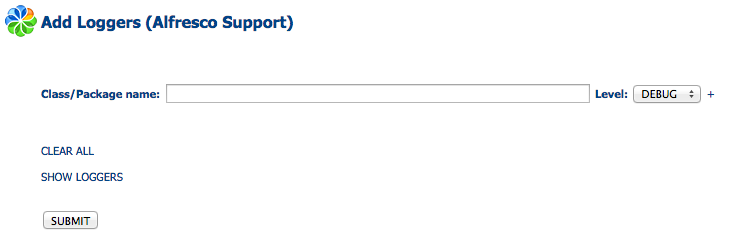
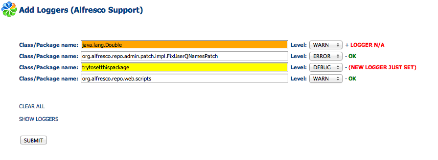
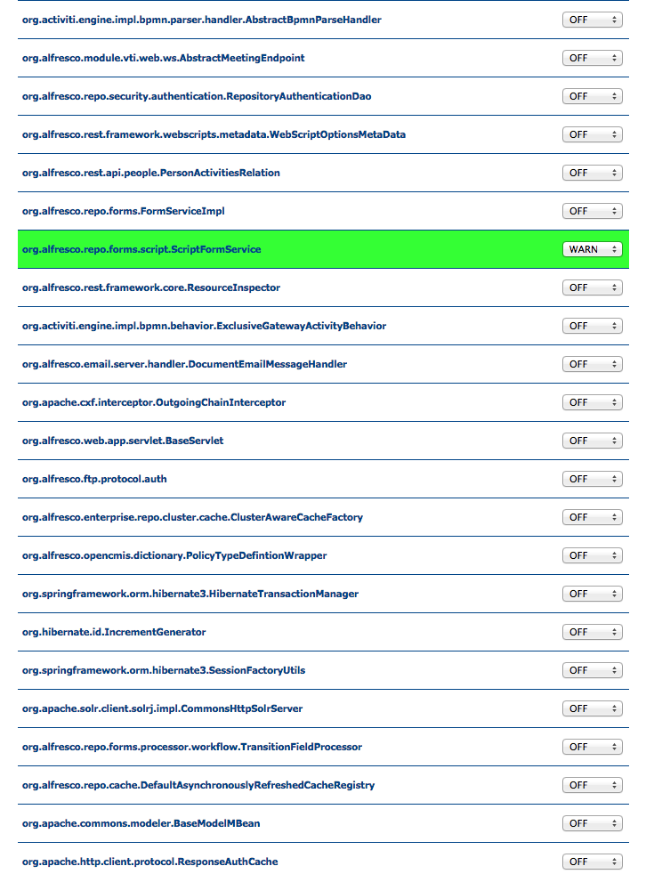

# add-loggers AMP project  
    
    
## Introduction

Modifying the log level of a class or a package in Alfresco involves two options:

1. Modify the Alfresco log4j.properties file, OR
2. Use JMX console.

_But_

**Option 1** requires a server restart

**Option 2** is not always possible (sometimes it is not possible or very difficult to access the JMX console).

On top of this it does not allow to set log levels for packages, just for classes.

Considering the limitations of these two solutions, here a javascript webscript to dynamically set many log levels with no need to restart Alfresco nor access the JMX console.

Since the the webscript is developed in Javascript, it does not require a server restart.

## How to install

Two installation methods are available for this AMP:

1. Hot Deployment
2. Standard Deployment

---------------------------------------

For an **HOT DEPLOYMENT** execute the following command (amending the paths to your case):

	``java -jar [ALFRESCO_HOME]/bin/alfresco-mmt.jar install add-loggers-x.y.z.amp [TOMCAT_HOME]/webapps/alfresco -nobackup``

This command will add the webscript to the exploded Alfresco application folder (no server restart needed).

**IMPORTANT NOTE:** For this option is necessary to refresh the Alfresco webscripts going to http://host]:[port]/alfresco/service/index and clicking the "Refresh Webs Scripts" button.

For a **STANDARD DEPLOYMENT** execute the following steps:

* Stop Alfresco
* Execute the following command amending the paths to your case

	``java -jar [ALFRESCO_HOME]/bin/alfresco-mmt.jar install add-loggers-x.y.z.amp [TOMCAT_HOME]/webapps/alfresco.war``
	
* Remove eventual existing tomcat/webapps/alfresco folder
* Restart Alfresco

## How to run it

Go to **http://[host]:[port]/alfresco/service/support/addLoggers** to use the webscript

## How to use it

It is possible to either set manually a list of classes/packages using the input box and submitting the request or using the Show Loggers utility to set a single log level.

* Insert the class/package name inside the **Class/Package** input box.
* Change the log level with the select input (**ALL,TRACE,DEBUG,INFO,WARN,ERROR,FATAL,OFF**).
* Click on "**+**" to add an additional input box.
* Click on "**-**" to remove that specific input box.
* Click on **Submit** to send the request.
* Click on **CLEAR ALL** to clear all the previously set inputs from the form.
* Click on **SHOW LOGGERS/HIDE LOGGERS** to show/hide currently set loggers and set specific logs.

## Notes

* Changes are **NOT** persisted into the Database, so restarting the server will delete all previous modifications
* When changing the log level from the LOGGERS list is **NOT** necessary to click Submit

## Interpreting the results

The webscript will interpret the inputs and set the logs.
  
  * If the submitted class/package exists and it is set properly it will show a *green* **OK** message next to the input
  
  * If the submitted class does not have a logger the input will be set to *orange* and next to it the *red message*: ***LOGGER N/A***
  
  * If the submitted class/package is not recognised the logger will be set anyway and input will be set to *yellow* with a *red* warning message: ***(NEW LOGGER JUST SET)***

  * Setting the log level via the Show loggers utility will highlight the class/package name with *green* colour. 

When the webscript successfully sets the logger in your alfresco.log you will see a message such as:

	``WARN  [repo.web.scripts] [http-bio-8080-exec-15] *** ADDLOGGER -->LOGGER for org.alfresco.repo.web.scripts activated with WARN LEVEL ***
	ERROR [patch.impl.FixUserQNamesPatch] [http-bio-8080-exec-4] *** ADDLOGGER -->LOGGER for org.alfresco.repo.admin.patch.impl.FixUserQNamesPatch activated with ERROR LEVEL ***``

**Note:** the log level of each message will be the same of the level set for that logger.
